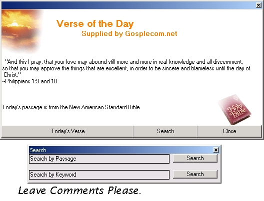



## Your Daily Bible Verse

### Description

I have added some extra forms to Jameson Schriber's HTML Parser App here on PSC.

It now is a full Program that will get Daily Bible Verses, allow you to search and read Verses aswell. You can place it in your Startup Folder so that it starts with windows so that you get a new verse everyday.

HTML Parser: http://www.Planet-Source-Code.com/vb/scripts/ShowCode.asp?txtCodeId=26877&lngWId=1

Have Fun,

NEW: Added command 'start' to program, now you can enter it into the command line the command buttons will be hidden, useful for the windows startup.

Added some graphics and link to the source website.
 
### More Info
 

             |
---                |---
**Submitted On**   |2002-09-30 14:24:50
**By**             |[\-New\_Kid\-](https://github.com/Planet-Source-Code/PSCIndex/blob/master/ByAuthor/new-kid.md)
**Level**          |Intermediate
**User Rating**    |4.3 (26 globes from 6 users)
**Compatibility**  |VB 6\.0
**Category**       |[Complete Applications](https://github.com/Planet-Source-Code/PSCIndex/blob/master/ByCategory/complete-applications__1-27.md)
**World**          |[Visual Basic](https://github.com/Planet-Source-Code/PSCIndex/blob/master/ByWorld/visual-basic.md)
**Archive File**   |[Your\_Daily1387419302002\.zip](https://github.com/Planet-Source-Code/new-kid-your-daily-bible-verse__1-39377/archive/master.zip)

